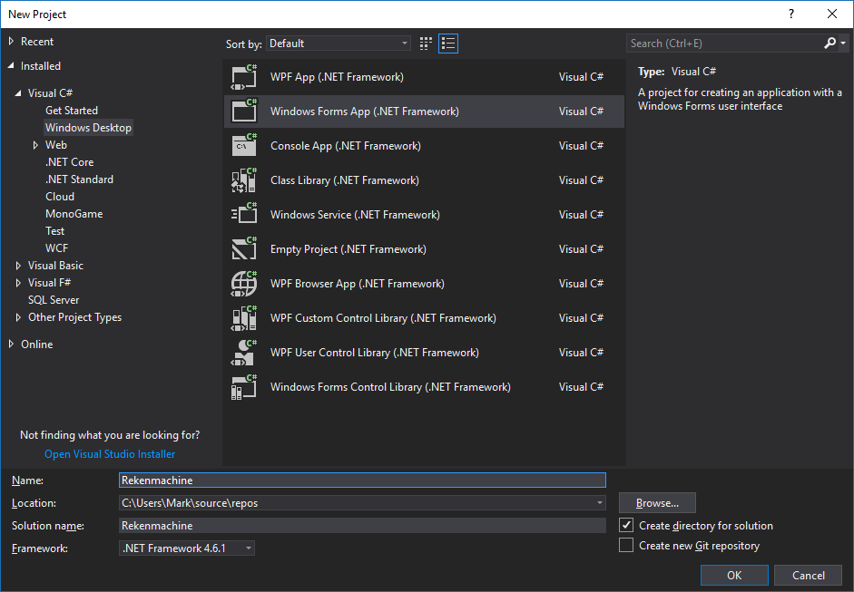
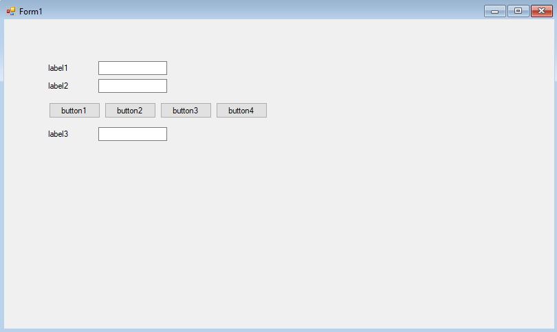

# **Opdracht 1: De rekenmachine**

In deze opdracht gaan we een eenvoudige rekenmachine ontwikkelen met C#.

1.  De eerste stap is het maken van een nieuw project. Open hiervoor Visual Studio 2019, als deze niet al is geopend. Maak een nieuw project aan door te klikken op File \> New \> Project.


2.  In het scherm wat nu verschijnt kan je het projecttype selecteren. Kies voor een Windows Forms applicatie. Deze is te vinden onder de taal C# en het platform Windows. Het type applicatie is Desktop.

3.  Voer onderin het scherm ook een naam in voor je project, bijvoorbeeld 'Rekenmachine' en klik op OK om het project aan te maken.



4.  Standaard opent de windows forms applicatie in 'Design view'. Hier kan je de user interface van je applicatie ontwerpen door 'controls' toe te voegen en deze in te stellen. Een control is bijvoorbeeld een knop of een invulveld.

5.  Open de 'Toolbox'. Deze is te vinden als een tabje aan de linkerkant van het scherm. Zie je het tabje en de toolbox niet? Klik dan op View \> Toolbox in het menu.


6.  Vanuit de toolbox kan je controls op het form plaatsen. 

Wanneer de toolbox niet beschikbaar is selecteer **View** in de navigatebalk en vervolgens **Solution Explorer**.

Zet de volgende controls op het form, en probeer hierbij de lay-out van het voorbeeld na te maken:

-   3x Label

-   3x TextBox

-   4x een Button.

Het voorbeeld:



7.  Met de 'Properties' rechts onderin het scherm kan je eigenschappen van de controls instellen. Namen en teksten van labels en knoppen veranderen. Breng de volgende wijzigingen aan:

-   Textbox1: Name = invoerBox1

-   Textbox2: Name = invoerBox2;

-   Textbox3: Name = resultaatBox;

-   Label1: Text = Getal 1

-   Label2: Text = Getal 2

-   Label3: Text = Resultaat

-   Button1: Name = 'plusButton', Text = '+'

-   Button2: Name = 'minButton', Text = '-'

-   Button3: Name = 'keerButton', Text = '\*'

-   Button4: Name = 'gedeeldButton', Text = '/'

8.  Om de buttons iets te laten doen moeten we code schrijven. Dubbeklik op de plus knop om naar de code van deze knop te gaan. Je komt nu in de methode die aan de knop gekoppeld is, en alle code tussen de { en } zal worden uitgevoerd als de gebruiker op de knop klikt.

9.  We gaan eerst de inhoud van de tekstboxen in variabelen plaatsen. Daarna voeren we de berekening uit en plaatsen we het resultaat in de resultaatBox. Voeg onderstaande code tussen de { } toe.

```csharp
private void plusButton_Click(object sender, EventArgs e)
{
  double getal1 = Convert.ToDouble(invoerBox1.Text);

  double getal2 = Convert.ToDouble(invoerBox2.Text);

  double resultaat = getal1 + getal2;
  resultaatBox.Text = resultaat.ToString();
}

```

Deze code kan er op het eerste gezicht ingewikkeld uitzien, omdat er op elke regel meerdere dingen tegelijkertijd gebeuren. De eerste regel code bevat de volgende 3 onderdelen:

-   **invoerBox1.Text** bevat de tekst die de gebruiker in de tekstbox heeft getypt.

-   **Convert.ToDouble(**invoerBox1.Text**)** zet deze tekst om naar een getal. Met tekst zou je niet kunnen rekenen. In C# is daarom een conversie nodig.

-   **double getal1** = Convert.ToDouble(invoerBox1.Text) plaatst dit getal in een nieuwe variabele met de naam getal1.

'getal1' bevat uiteindelijk dus het getal dat door de gebruiker is ingetypt.

10. Test nu de applicatie uit. Voer twee getallen in de eerste twee textboxes en klik op de plus knop. Als alles goed is gegaan zie je nu de som van de getallen in de derde textbox.

11. Maak nu de 'gedeeld door' knop werkend. Hiervoor kan je hetzelfde doen als bij stap 9, je hoeft alleen de berekening te veranderen:

> **double resultaat = getal1 / getal2;**

12. Maak tenslotte zelf de 'min' en 'keer' knoppen werkend.
