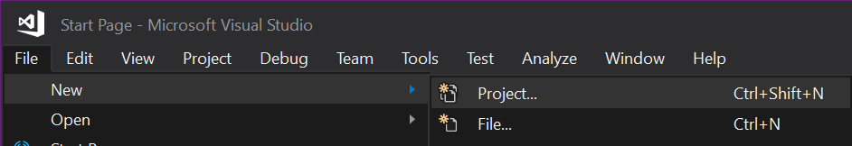
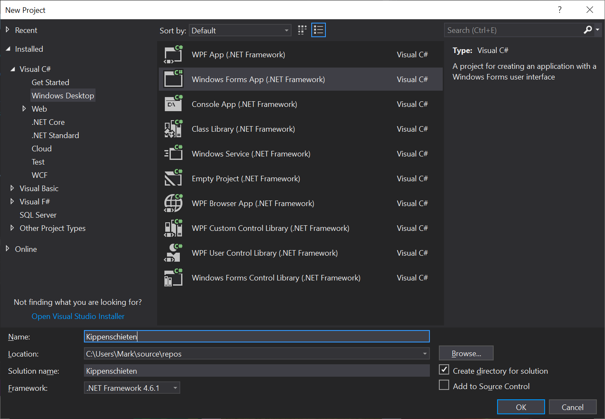
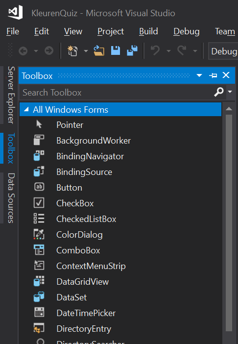
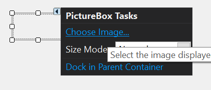
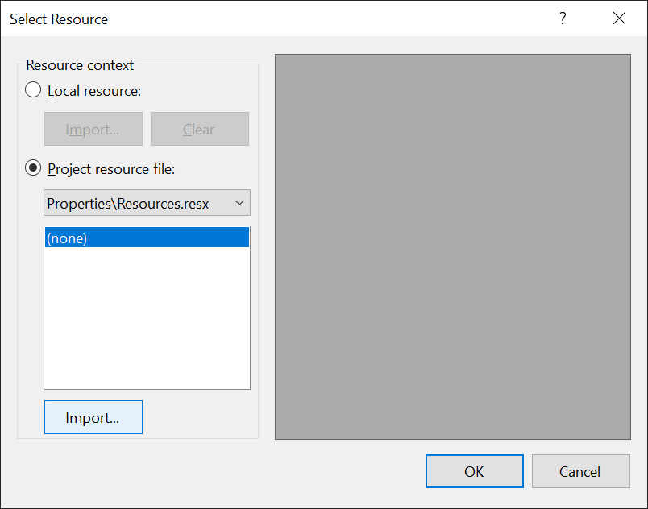
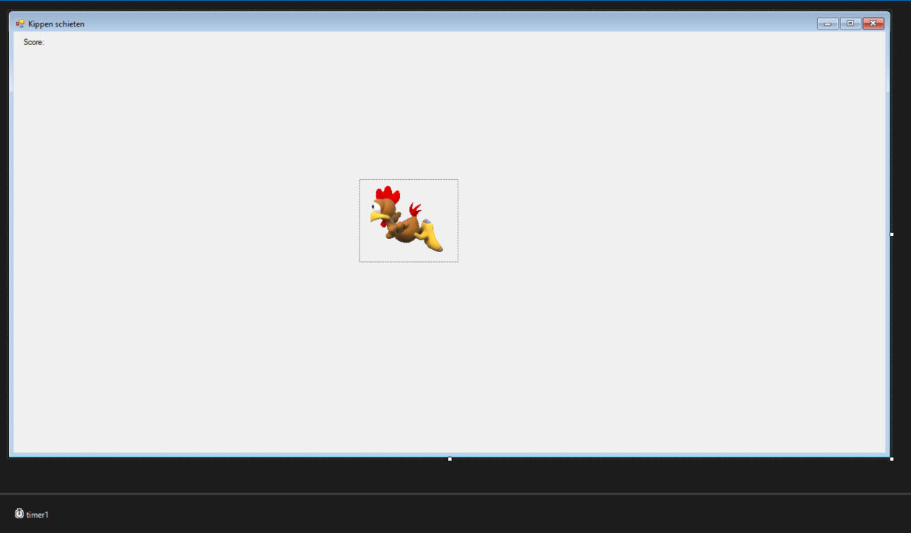
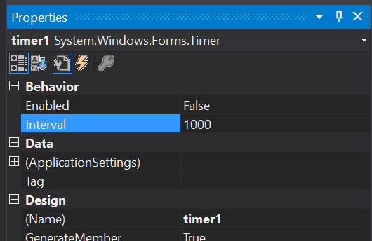

# **Opdracht 2: Kippen schieten**

Voor deze opdracht ontwikkelen we een zeer eenvoudig spel in C#

1.  De eerste stap is het maken van een nieuw project. Open hiervoor Visual Studio 2019, als deze niet al is geopend. Maak een nieuw project aan door te klikken op File \> New \> Project.



1.  In het scherm wat nu verschijnt kan je het projecttype selecteren. Kies voor een Windows Forms applicatie. Deze is te vinden onder de taal C# en het platform Windows. Het type applicatie is Desktop.

2.  Voer onderin het scherm ook een naam in voor je project, bijvoorbeeld 'Kippenschieten' en klik op OK om het project aan te maken.



4.  Standaard opent de Windows Forms applicatie in 'Design view'. Hier kan je de user interface van je applicatie ontwerpen door 'controls' toe te voegen en deze in te stellen. Een control is bijvoorbeeld een knop of een invulveld.

5.  Open de 'Toolbox'. Deze is te vinden als een tabje aan de linkerkant van het scherm. Zie je het tabje en de toolbox niet? Klik dan op View \> Toolbox in het menu.



6.  Zet de volgende controls uit de toolbox op het form

-   1x PictureBox

-   1x Label

-   1x Timer (niet zichtbaar op het form, komt onderaan in beeld)

7.  Klik op het kleine pijltje dat je ziet zodra je de net geplaatste PictureBox selecteert. Klik op 'Choose Image...'



Nu verschijnt het 'Select Resource' scherm. Klik hier op de Import knop en selecteer de Kip afbeelding van je bureaublad.



Vergroot je PictureBox zodat deze de hele kip toont. Verander ook de name onder de properties van pictureBox1 naar chickenPicture.

Pas nu de grootte van het form (het grijze venster) aan zodat het er ongeveer zo uitziet:



En verander van het Label de Name property (rechts onderin bij Properties) naar 'scoreLabel' en de Text naar 'Score: 0'.

8.  Selecteer nu timer1. Stel onder properties Enabled op True, en de interval op 40. Dat staat voor 40 milliseconden, en betekent dat we de timer 25 keer per seconde iets kunnen laten doen.



> Klik in hetzelfde scherm op het bliksemschicht icoontje. Voer hier bij het Event **timer1_Tick** en druk op enter. Je komt dan in het codescherm terecht, waar we de volgende code in gaan vullen:

```csharp
int speed = 4;**

private void timer1_Tick(object sender, EventArgs e)
{
  chickenPicture.Left = chickenPicture.Left - speed;
}
```
Probeer je programma uit. De kip zou naar links moeten vliegen. Sluit je programma weer af.

9.  We moeten ervoor zorgen dat zodra de kip uit beeld verdwijnt, deze weer vanaf rechts binnen komt vliegen Als je uit het codescherm bent, ga dan terug naar het codescherm. Dat kan met F7.

Voeg de volgende code toe:

```csharp
int speed = 4;

private void timer1_Tick(object sender, EventArgs e)
{
  chickenPicture.Left = chickenPicture.Left - speed;

  if(chickenPicture.Left \< 0 - chickenPicture.Width)
  {
      ResetKip();
  }
}

void ResetKip()
{
  chickenPicture.Left = this.Width;
  speed++;
}
```
> Probeer het uit en controleer of de kip inderdaad telkens opnieuw aan komt vliegen.

10. We willen dat als je op de kip klikt, de score wordt verhoogt met 25. Ook willen we dat de kip dan verdwijnt en opnieuw binnen komt vliegen. Zorg dat je weer in de Design view bent (shift+F7 of klikken op de Form1.cs \[Design] en dubbelklik op de PictureBox.

Voeg de volgende code toe:
```csharp
int score = 0;

private void chickenPicture_Click(object sender, EventArgs e)
{
  score = score + 25;
  scoreLabel.Text = "Score:" + score.ToString();
  ResetKip();
}
```
En probeer uit of het werkt.

11. Het zou beter zijn als de kip telkens vanaf een willekeurige (random) hoogte binnen komt vliegen, in plaats van telkens vanaf dezelfde hoogte. Hiervoor kunnen we de ResetKip methode aanpassen.

```csharp
void ResetKip()
{
  Random random = new Random();

  int randomHeight = random.Next(0, this.Height - chickenPicture.Height);

  chickenPicture.Top = randomHeight;

  chickenPicture.Left = this.Width;

  speed++;
}
```
1.  Dit is voor nu een zeer eenvoudige versie van ons kippenspel. Geef aan bij de docenten dat je de opdracht hebt afgerond.

Als je overigens echt games wilt programmeren doe je dat niet op deze manier, maar verdiep je je bijvoorbeeld in Unity (<https://unity3d.com/>), Godot (<https://godotengine.org/>) of Cocos2D.