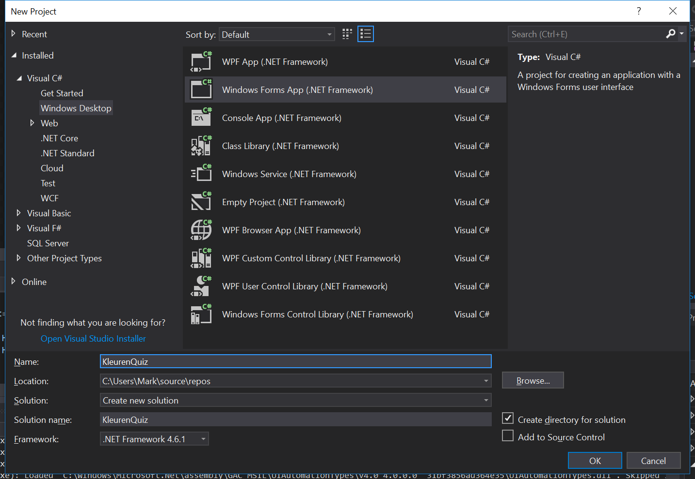

# **Opdracht 3: Kleurenquiz**

In deze opdracht gaan we een kleurenquiz ontwikkelen met C#. Het idee achter de kleurenquiz is dat je op een knop moet klikken **waarvan de tekst overeenkomt met de kleur van het scherm**.

De kleur van de knop kan echter afwijken van de tekst, waardoor de gebruiker in de war kan raken. Uiteindelijk krijg je een score gebaseerd op het aantal keer dat je de juiste kleur hebt aangeklikt.

1.  De eerste stap is het maken van een nieuw project. Open hiervoor Visual Studio 2019, als deze niet al is geopend. Maak een nieuw project aan door te klikken op File \> New \> Project.


2.  In het scherm wat nu verschijnt kan je het projecttype selecteren. Kies voor een Windows Forms applicatie.

3.  Voer onderin het scherm ook een naam in voor je project, bijvoorbeeld 'Kleurenquiz' en klik op OK om het project aan te maken.



4.  Standaard opent de Windows Forms applicatie in 'Design view'. Hier kan je de user interface van je applicatie ontwerpen door 'controls' toe te voegen en deze in te stellen. Een control is bijvoorbeeld een knop of een invulveld.

5.  Open de 'Toolbox'. Deze is te vinden als een tabje aan de linkerkant van het scherm. Zie je het tabje en de toolbox niet? Klik dan op View \> Toolbox in het menu.


6.  Vanuit de toolbox kan je controls op het form plaatsen. Zet de volgende controls op het form, en probeer hierbij de lay-out van het voorbeeld na te maken:

-   3x een button

-   1x een timer

-   1x een label

Het voorbeeld:


7.  Met de 'inspector' rechts onderin kan je eigenschappen van de controls instellen. Namen en teksten van labels en knoppen veranderen. Breng de volgende wijziging aan:

-   Label1: Name = scoreLabel, Text = 0

8.  Om de applicatie iets te laten doen moeten we code schrijven. Dubbelklik op de titelbalk of in het lege grijze gedeelte, dan kom je in de form_load methode. Alle code tussen de { en } zal worden uitgevoerd als de gebruiker als de applicatie start.


9.  In deze methode kunnen we onze quiz starten. Laten we beginnen met één keer de gebruiker de juiste kleur te laten kiezen.

We stellen de achtergrondkleur van de applicatie in op rood, en vervolgens de kleuren en teksten van de 3 knoppen. We doen dit eerst handmatig, pas later in de opdracht laten we dit willekeurig door de computer kiezen.

Plaats de volgende code binnen de { } van de Form_Load methode:

> this.BackColor = Color.Red;
>
> button1.BackColor = Color.Red;
>
> button2.BackColor = Color.Green;
>
> button3.BackColor = Color.Blue;
>
> button1.Text = \"Groen\";
>
> button2.Text = \"Rood\";
>
> button3.Text = \"Blauw\";

10. De tekst van het label en de tekst op de buttons zal slecht leesbaar zijn als we de achtergrondkleur aanpassen. Je kunt deze tekst groter maken door het instellen van de 'Font' property. Probeer dit zelf. Natuurlijk kan je de grootte van het label en de buttons ook veranderen, zodat de grotere tekst erin blijft passen.

> Ga terug naar de design view met shift+F7 en pas properties naar wens aan zodat de knoppen goed leesbaar zijn.

11. We willen dat de gebruiker een punt krijgt als hij op de button klikt waarvan de tekst overeenkomt met de achtergrondkleur van de applicatie. In dit voorbeeld is dat button 2.

Dubbelklik op button2

> Boven de methode (dus voor private void Button1_Click) maak je wat ruimte en plaats je de volgende dikgedrukte code;

```csharp
int score = 0;
int pogingen = 0;

private void button2_Click(object sender, EventArgs e)
{

}
```

12. in de Button2_Click methode zelf (tussen de { }) plaats je de volgende code:

```csharp
private void button2_Click(object sender, EventArgs e)
{
  score++;
  scoreLabel.Text = score.ToString();
  pogingen++;
}
```

> Let op: ++ telt 1 bij de variabele op. De code *score = score + 1;* zal ook werken.

13. Start je applicatie en je ziet dat telkens als je op de knop met de tekst 'rood' klikt, de score met 1 verhoogt.

> Maar we willen de gebruiker 10x laten raden, en telkens een andere kleur. Ook willen we de tekst op de buttons veranderen.
>
> Willekeurige keuzes maken kan met de Random class. We vervangen de Button2_Click code met de volgende code

```csharp
private void button2_Click(object sender, EventArgs e)
{
  scoreLabel.Text = score.ToString();
  pogingen++;

  Random rng = new Random();

  int getal = rng.Next(3);

  if (getal == 1)
  {
    this.BackColor = Color.Red;
  }

  else if (getal == 2)
  {
    this.BackColor = Color.Green;
  }
  else
  {
    this.BackColor = Color.Blue;
  }
}
```

14. Als je nu de applicatie probeert zie je dat zodra je klikt, de kleur willekeurig verandert. Het kan zijn dat de kleur een paar keer achter elkaar hetzelfde is.

Om het wat moeilijker te maken willen we dat ook de teksten op de buttons veranderen.

> Daarvoor maken we onder de vorige code in Button2_Click weer een random getal:

```csharp
int getal2 = rng.Next(3);

if (getal2 == 1)
{
  button1.Text = "Rood";

  button2.Text = "Groen";

  button3.Text = "Blauw";
}

else if (getal2 == 2)
{
  button1.Text = "Groen";
  button2.Text = "Blauw";
  button3.Text = "Groen";  
}
else
{
  button1.Text = "Blauw";
  button2.Text = "Rood";
  button3.Text = "Groen";
}
```

15. Maar we zijn er nog niet. We willen punten geven als de gebruiker de juiste knop aanklikt.

> Het is heel inefficiënt om voor de drie knoppen telkens dezelfde code te gaan schrijven. Gelukkig kunnen dezelfde methode koppelen aan de 3 knoppen, en kunnen we vanuit de code kijken op welke knop is geklikt.

Voeg de volgende code toe helemaal **bovenaan** de Button2_Click methode
```csharp
Button aangeklikt = (Button)sender;

if (this.BackColor == Color.Red && aangeklikt.Text == "Rood")
{
  score++;
}

if (this.BackColor == Color.Blue && aangeklikt.Text == "Blauw")
{
  score++;
}

if (this.BackColor == Color.Green && aangeklikt.Text == "Groen")
{
  score++;
}
```

16. Nu kan je dezelfde methode koppelen aan alle drie knoppen. Klik op de \[design\] tab


> En klik vervolgens op button1. (1x klikken, niet dubbelklikken! Want dan zou je weer naar het codescherm gaan)
>
> Klik vervolgens op de bliksemflits onder properties, dan in dropdown bij Click de Button2_click methode kiezen. Hetzelfde kan je vervolgens voor button 3 doen.


1.  Na 10 pogingen willen we de quiz beëindigen. Daarvoor gaan we weer terug naar de code van Button2_Click. De dikgedrukte code is nieuw en komt tussen bestaande code.
```csharp
scoreLabel.Text = score.ToString();
pogingen++;

if(pogingen == 10)
{
  MessageBox.Show($"Je score was: {score} van de {pogingen}");

  pogingen = 0;
  score = 0;
  scoreLabel.Text = "0";
}

Random rng = new Random();

int getal = rng.Next(3);
```
18. We willen ook graag dat de gebruiker maar 3 seconden krijgt om te beslissen. Dat kan met de timer die we eerder op het form hebben gezet.

> We maken eerst een nieuwe methode met alles wat we willen doen als een poging voorbij is. Deze methode maak je met de volgende code. Zorg dat deze buiten de button2_click methode staat, bijvoorbeeld erboven, zoals in het voorbeeld hieronder.

```csharp
void NieuweKleur()
{
}


private void button2_Click(object sender, EventArgs e)

{
}
```

> Vervolgens kunnen we de bestaande code die zorgt voor de nieuwe kleur verplaatsen (met knippen & plakken) vanuit de button click methode, naar onze eigen methode. De code die controleert of je de juiste knop hebt aangeklikt en de score verhoogt verplaats je niet.
>
> Dat komt er dan zo uit te zien:

```csharp

void NieuweKleur()
{
  Random rng = new Random();
  int getal = rng.Next(3);

  if (getal == 1)
  {  
    this.BackColor = Color.Red;
  }

  else if (getal == 2)
  {
    this.BackColor = Color.Green;
  }
  > else
  {
    this.BackColor = Color.Blue;
  }

  int getal2 = rng.Next(3);

  if (getal2 == 1)
  {
    button1.Text = "Rood";
    button2.Text = "Groen";
    button3.Text = "Blauw";
  }

  else if (getal2 == 2)
  {
    button1.Text = "Groen";
    button2.Text = "Blauw";
    button3.Text = "Rood";
  }
  else
  {
    button1.Text = "Blauw";
    button2.Text = "Rood";
    button3.Text = "Groen";
  }
}
```
19. Vervolgens roepen we dit aan vanuit de button click methode. De methode aanroepen doe je zo:

> NieuweKleur();
> 
De code van de button click methode wordt dan (het dikgedrukte is nieuw):

```csharp
private void button2_Click(object sender, EventArgs e)

{
  Button aangeklikt = (Button)sender;

  if (this.BackColor == Color.Red && aangeklikt.Text == "Rood")
  {
    score++;
  }

  if (this.BackColor == Color.Blue && aangeklikt.Text == "Blauw")
  {
    score++;
  }

  if (this.BackColor == Color.Green && aangeklikt.Text == "Groen")
  {
    score++;
  }

  scoreLabel.Text = score.ToString();

  if (pogingen == 10)
  {

    MessageBox.Show($"Je score was: {score} van de {pogingen}");

    pogingen = 0;

    score = 0;

    scoreLabel.Text = "0";
  }

  NieuweKleur();
}

```
20. Nu we een aparte methode hebben, kunnen we die ook vanuit de timer aanroepen. Ga met shift+F7 naar de design view en stel onder properties de interval op 3000 (let er wel op dat je weer properties ziet. Klik daarvoor op het pictogram links van de bliksemflits).


> En dubbelklik op de timer. Ook hier willen we onze nieuwe methode aanroepen:
```csharp
private void timer1_Tick(object sender, EventArgs e)
{
  NieuweKleur();
}
```
21. Aan het begin van de NieuweKleur methode willen we onze timer opnieuw starten zodat de gebruiker opnieuw 3 seconden krijgt. Voeg deze code toe bovenaan de Nieuwe Kleur methode:

```csharp
pogingen++;

timer1.Stop();
timer1.Start();

```

> Haal ook de regel pogingen++; weg uit de Button2_Click methode. Anders zou je elke klik dubbel tellen.
>
> En als de quiz voorbij is stoppen we de timer ook, dus plaats deze code direct onder de vorige:

```csharp
if (pogingen == 10)
{
  timer1.Stop();

  MessageBox.Show($"Je score was: {score} van de {pogingen}");
  pogingen = 0;
  score = 0;

  scoreLabel.Text = "0";

}

22. Voer zonder uitleg en stappenplan nu de volgende wijzigingen door:

-   Maak de tekst op de buttons 2x zo groot, wit gekleurd en dik gedrukt.

-   Doe hetzelfde met het score label

-   Verander de tekst in de titelbalk van Form1 naar "Kleurenquiz"

-   Zorg dat de gebruiker 20x kan raden

-   Zorg dat de gebruiker maar 1 seconde tijd heeft voor een poging

En geef zodra dit is gelukt bij de docenten aan dat je de opdracht hebt afgerond.
