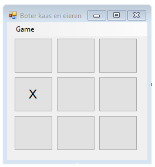

# **Opdracht 4: Boter, Kaas en Eieren**

Maak het spel Boter, Kaas en Eieren als een **Windows Forms applicatie**.

In het voorbeeld hieronder zie je een form met 9 buttons. Zodra de speler op een button klikt, wordt hier een X in gezet, en zet de computer in een willekeurige andere button een O.

Het is daarna niet meer mogelijk om op deze knoppen te klikken.

Je zou ook een variant kunnen maken met 2 spelers, waarbij de spelers om en om mogen klikken om een X of een O te plaatsen.

Heeft een speler als eerste drie X'en of O'en op een rij, dan heeft deze gewonnen en wordt er een melding getoond.

